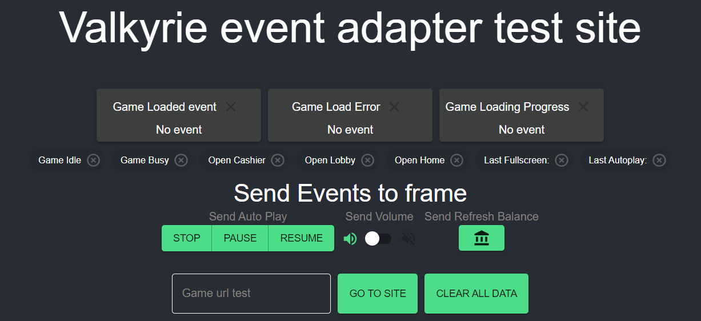

# valkyrie-event-adapter
[](./LICENSE.md) 
[](https://github.com/valkyrie-fnd/valkyrie-event-adapter/actions/workflows/release-and-publish.yaml)

[](https://valkyrie-fnd.github.io/valkyrie-event-adapter/)


[](https://github.com/valkyrie-fnd/valkyrie-event-adapter/releases)


Frontend library written in Typescript to use in game provider games to communicate with operator displaying your game.

Also used on operator side in order to map events from providers to your system.

[Documentation](./docs/README.md)

# Usage
## Installing
```
npm i @valkyrie-fnd/valkyrie-event-adapter
```
or using yarn
```
yarn add @valkyrie-fnd/valkyrie-event-adapter
```
## Provider 
If your're a provider and want to follow Valkyrie events you use `ValkyrieWrapper`.

In relevant places in your code you need to call `ValkyrieWrapper` to notify it of events that happen. Eg `vm.gameLoaded()` when the game's resources are finished loading.

When implemented fully, you can make use of the test site (read below) to verify your events are being sent as expected. Read the [docs](./docs/classes/ValkyrieWrapper.md) what functions exist and verify using the test site.

``` typescript
import { ValkyrieWrapper } from '@valkyrie-fnd/valkyrie-event-adapter';
//...
// Get valkyrieReceiver instance
const vw = new ValkyrieWrapper(window.parent, window, valkyrieReceiver);
const unregister = vw.init();

//....
// Call once the game is loaded and has the UI ready to be shown to the player.
// Should not be called while the game is still in process of loading assets etc
vw.gameLoaded();

//...
// If you need to remove any event listeners
unregister();
```
`valkyrieReceiver` needs to implement the `ValkyrieReceiver` interface.
``` typescript
export interface ValkyrieReceiver {
  autoPlay?: (action: AutoPlayAction) => void
  volume?: (muted: boolean) => void
  refreshBalance?: () => void
}
```
Commands sent by the wrapper of your game should be handled by it.  
Eg. when the wrapper send a autoplay command the `autoPlay`-function on `ValkyrieReceiver` will be called and your game should handle it.


`unregister` is a function that will remove event listeners that is added to the second parameter(`window`).

Read documentation full [here](./docs/README.md)

## Operator
TBW

# Test site
To verify a game send the correct events and has implemented `ValkyrieReceiver` interface correctly you can use the test site.

It is available [here](https://valkyrie-fnd.github.io/valkyrie-event-adapter). To use it, simply paste a url to a game in the input field and validate all events are coming in as expected, as well as validating the game iframe responds to the events sent to it.


The source code for the test site is available [here](./test-site/).

# Publishing

Make sure [CHANGELOG](./CHANGELOG.md) is updated with relevant changes.

When ready to release then use [Prepare release workflow](https://github.com/valkyrie-fnd/valkyrie-event-adapter/actions/workflows/prepare-release.yaml) to prepare a release. This will create a PR for you to merge. Upon merge of the PR a github release will be created as well as the package published to NPM.
